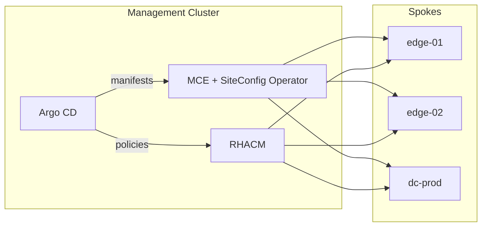
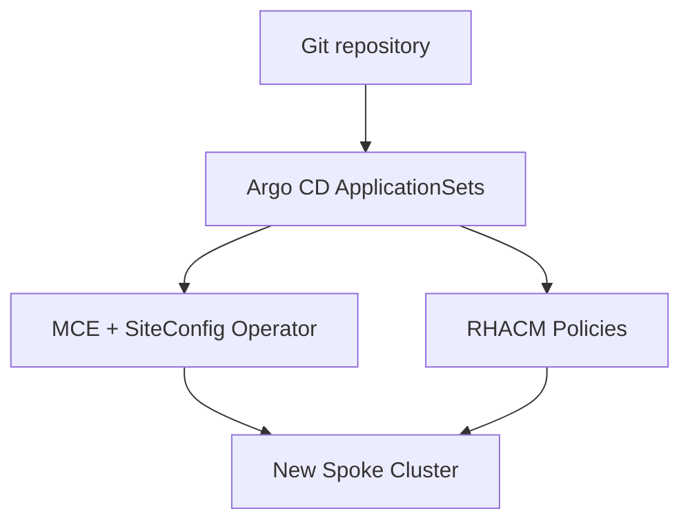

# **Zero Touch Provisioning (ZTP) with Argo CD on OpenShift**

> **Goal →** Build **production‑ready OpenShift clusters** the GitOps way—no ISO juggling, no console cables, just declarative YAML in Git.

---

## Why should I care?

When you manage **dozens—or hundreds—of clusters** in data centers, telco edges, or factory floors, *manual* installs simply don’t scale.  
**Zero Touch Provisioning (ZTP)** turns Day‑1 install **and** Day‑2 config into a single automated pipeline driven from Git:

* **Repeatable** – New clusters are born from the same manifests.  
* **Consistent** – Policies and upgrades follow the same Git flow as application code.  
* **Auditable** – RHACM dashboards provide fleet‑wide compliance at a glance.

ZTP shifts the question from **“How do I install this server?”** to **“What should my cluster look like?”**

This hands‑on guide gives you copy‑paste YAML, explains every manifest, and shows best practices for Day 1 *and* Day 2— all inside one GitOps pipeline.

---

  
## Hub‑and‑Spoke Topology  

| Role   | Runs Where                           | Responsibilities                                                   |  
|:------:|:-------------------------------------|:-------------------------------------------------------------------|  
| **Hub**   | Central management OpenShift cluster | Hosts MCE, RHACM, and Argo CD; orchestrates provisioning and policy enforcement.  |  
| **Spoke** | Each provisioned OpenShift cluster    | Runs customer workloads; reports health and compliance back to the hub.         |  



The **hub**, manage provision, configure, and governs **spoke** clusters. Key components:  

1. **Git** holds the *single source of truth*.  
2. **Argo CD** watches Git and applies manifests to the hub.  
3. **MCE & SiteConfig Operator** create the spoke cluster.  
4. **RHACM** applies Day‑2 policies (operators, storage, SR‑IOV, …). 

---

## GitOps Pipeline Overview  


1. **Commit**: Add `ClusterInstance` and `PolicyGenTemplate` manifests to Git.  
2. **Sync**: Argo CD detects changes and applies them to the hub.  
3. **Install**: SiteConfig Operator consumes `ClusterInstance`, triggering the Assisted or Agent installer.  
4. **Govern**: RHACM applies policies to each spoke and remediates drift.  
5. **Loop**: Git remains the single source of truth for all cluster state.  

---

## A Practical Use Case


### Preparing the Hub

> The hub is a standard OpenShift cluster plus three operators.

| Operator | Why it matters (one line) |
|----------|---------------------------|
| **OpenShift GitOps** | Installs **Argo CD**, the reconciler that pulls from Git and applies changes. |
| **Multicluster Engine (MCE)** | Brings the **SiteConfig Operator** and Assisted/Agent installer back‑ends. |
| **RHACM** | Converts `PolicyGenTemplate` into ACM Policies and shows compliance. |

Install and instantiate the three operators from OperatorHub (`stable` channel) or via `Subscription` YAML.

---

#### Enable the SiteConfig API

The SiteConfig operator and `ClusterInstance` API are core to ZTP’s automation, simplifying and scaling OpenShift cluster provisioning.

To enable SiteConfig Operator type  the following command:

```bash
oc patch multiclusterhubs.operator.open-cluster-management.io multiclusterhub \
  -n open-cluster-management \
  --type=json \
  --patch '[{"op":"add","path":"/spec/overrides/components/-","value":{"name":"siteconfig","enabled":true}}]'
```

Verify:

```bash
$ oc get crd | grep siteconfig
clusterinstances.siteconfig.open-cluster-management.io
```


### Organize your repository with three top-level folders:

```text
siteconfig/    ← Day 1: Cluster provisioning manifests
policygen/     ← Day 2: PolicyGenTemplate manifests
deployment/    ← Argo CD Projects, Applications, and RBAC
```

### 1. **`siteconfig/` – Day‑1 Provisioning**

Think of each `<cluster>-siteconfig/` directory as a **self‑contained kit** that can spin up an entire OpenShift cluster with a single Git commit. It is built from four files:

| File | What It Contributes |
|------|---------------------|
| **`kustomization.yaml`** | The *shopping list* that glues everything together—Kustomize bundles the namespace, secrets, and the ClusterInstance CR into one atomic apply operation. |
| **`<cluster>-namespace.yaml`** | Creates a dedicated namespace on the hub so all Day‑1 and Day‑2 objects for that spoke stay neatly scoped and RBAC‑isolated. |
| **`<cluster>-secrets.yaml`** | Stores the pull secret plus BMC / IPMI credentials; the SiteConfig Operator reads these to power‑cycle hosts and pull the release payload. |
| **`<cluster>.yaml`** | A **ClusterInstance** CR that defines the cluster’s identity: OpenShift release (`clusterImageSetNameRef`), networking, bare‑metal inventory, and the labels used by Day‑2 policies. |

#### What you usually tweak per cluster

* **Namespace & Secret names** – Keep them unique (`spoke02-namespace.yaml`, `spoke02-secrets.yaml`) so Argo CD doesn’t collide resources.  
* **Release and Networking** – Adjust `spec.clusterImageSetNameRef`, `baseDomain`, and CIDRs to fit the site’s IP plan.  
* **Policy Labels** – Populate `spec.extraLabels` (e.g., `sites: europe-west1`, `env: prod`). Day‑2 `PolicyGenTemplate` binding rules match on these keys, so a clean label taxonomy now makes policy scoping effortless later.

#### Lifecycle after a merge

1. **Sync** – Argo CD detects the commit and applies the kustomization to the hub.  
2. **Provision** – The SiteConfig Operator reads the **ClusterInstance** CR, powers on the hosts, and streams the OpenShift payload via Assisted or Agent installer.  
3. **Register** – Minutes later, the new spoke appears in RHACM as a `ManagedCluster` and is ready for Day‑2 policy enforcement.

### Deep Dive: `spoke01-siteconfig`


LetsS dig inside `siteconfig/spoke01-siteconfig`:

- **`kustomization.yaml`**: References namespace, secrets, and ClusterInstance.
- **`sno01-namespace.yaml`**: Creates the cluster’s namespace.
- **`sno01-secrets.yaml`**: Holds BMC credentials and pull secret.
- **`sno01.yaml`**: The `ClusterInstance` CR that drives provisioning.

The **ClusterInstance** CR is where you declare everything the installer needs:
The **`ClusterInstance`** Custom Resource (CR) is the *heart* of Zero Touch Provisioning (ZTP) workflow.  
It captures **everything** the Assisted Installer needs to create a new
OpenShift cluster — release image, networking, and even bare‑metal host
inventory — in a single, declarative YAML file.  
Once committed to Git, Argo CD syncs the CR to the hub cluster, where the
SiteConfig operator turns it into the lower‑level resources that power on the
node and drive the install.
 
`ClusterInstance` replaces the older `SiteConfig` CR and is much closer to the upstream
**Cluster API** object model, which makes it easier to evolve toward a common provisioning
story across installers.

```yaml
apiVersion: siteconfig.open-cluster-management.io/v1alpha1
kind: ClusterInstance
metadata:
  name: spoke01-cluster
  namespace: spoke01-cluster
…
```

### 1.1  Field‑by‑Field Walk‑Through

| Field | Why it matters for ZTP |
|-------|------------------------|
| `metadata.name` / `spec.clusterName` | Acts as the canonical cluster ID. Must be unique across your fleet because it becomes the Kubernetes cluster‑name inside ACM. |
| `clusterImageSetNameRef` | Points to a `ClusterImageSet` CR that holds the exact OpenShift release image (4.17.23 here). Pinning this lets GitOps give you deterministic repeatability. |
| `baseDomain` | Shared with the hub’s DNS. The installer will create `api.<clusterName>.<baseDomain>` and `*.apps.<clusterName>.<baseDomain>`. |
| `machineNetwork` | Minimum network required for the installer to validate node reachability. |
| `networkType: OVNKubernetes` | Selects the SDN. In multi‑tenant edge topologies OVN is preferred because it works with IPv6 dual‐stack and SR‑IOV. |
| `sshPublicKey` | Injected into the `core` user on the node’s ignition, giving Day‑1 emergency access. |
| `pullSecretRef` | Reference to a Secret already present in the hub namespace; avoids leaking the JSON secret into Git. |
| `additionalNTPSources` | Time sync must be correct before the bootstrap VM tears down; this avoids clock skew during install. |
| `extraLabels` | Automatically applied on the resulting `ManagedCluster` object – very handy for policy placement (`placementRule` in ACM). |
| `templateRefs` | Allows you to overlay predefined bundles (e.g. install‑config snippets, LVM profiles) without copy/paste. |

### 1.2  `spec.nodes`

Because this is a **Single‑Node OpenShift (SNO)** deployment we only have one entry, but the schema is identical for multi‑node clusters.

```yaml
- role: master   # SNO ⇒ master == worker
  hostName: spoke01-master-0
  bmcAddress: redfish-virtualmedia://10.95.86.5/redfish/v1/Systems/1
  bootMAC: 14:23:F2:D5:9D:E0
  cpuArchitecture: x86_64
  nodeLabels:
    node-role.kubernetes.io/master: ""
  nodeNetwork:           # rendered directly into an NMStateConfig
    interfaces:
      - name: ens1f0np0          # physical NIC
        type: ethernet
        state: up
      - name: ens1f0np0.146      # VLAN for OpenShift API / Ingress
        type: vlan
        vlan:
          base-iface: ens1f0np0
          id: 146
        ipv4:
          address:
            - ip: 10.95.172.37
              prefix-length: 24
    routes:
      - destination: 0.0.0.0/0
        next-hop-address: 10.95.172.1
        next-hop-interface: ens1f0np0.146
```

*All the above collapses into an [`nmstateConfig`](https://nmstate.io/) that the
Agent writes before pivoting to the RHCOS image.*

### 1.3 **Governance Labels**

   ```yaml
   spec:
     extraLabels:
       ManagedCluster:
         environment: production
         region: europe-west1
         team: devops
         application: skynet
         sites: Montreal
   ```

   These labels let `PolicyGenTemplate` binding rules target exactly this cluster.


## 2. policygen/ (Day 2 Configuration)
Each `<cluster>-sno/` folder includes:
- `kustomization.yaml`: Aggregates `source-crs/` snippets
- `source-crs/`: YAML for operator subscriptions, network policies, etc.
- `spoke01-sno-configuration.yaml`: `PolicyGenTemplate` CR listing `sourceFiles`, `remediationAction`, and optional `ztp-deploy-wave`

**Customize**:
- `metadata.name` & namespace of PolicyGenTemplate
- `spec.bindingRules.sites` to match `extraLabels.sites`
- Snippets under `source-crs/` for required operators/policies

let's take a closer look at `policygen/spoke01-sno/spoke01-sno-configuration.yaml`:


The manifest below installs both **LVM** *and* **CNV** operators in a single
shot. Nothing is staged; ACM fires all resources off in one go.

```yaml
apiVersion: ran.openshift.io/v1alpha1
kind: PolicyGenTemplate
metadata:
  name: spoke-sno-configuration
  namespace: ztp-site
spec:
  mcp: master
  bindingRules:
    sites: Montreal
  sourceFiles:
#CNV Operator ###
    - fileName: cnv/cnv-ns.yaml
      remediationAction: enforce
      policyName: "cnv-operator"
    - fileName: cnv/cnv-subscription.yaml
      remediationAction: enforce
      policyName: "cnv-operator"
    - fileName: cnv/cnv-instance.yaml
      remediationAction: enforce
      policyName: "cnv-operator"
    - fileName: cnv/cnv-operatorgroup.yaml
      remediationAction: enforce
      policyName: "cnv-operator"
# LVM OPerator ###
    - fileName: lvm/ns.yaml
      remediationAction: enforce
      policyName: "lvm-operator"
    - fileName: lvm/subscription.yaml
      remediationAction: enforce
      policyName: "lvm-operator"
    - fileName: lvm/instance.yaml
      remediationAction: enforce
      policyName: "lvm-operator"
```


### How Policies Are Applied

1. **Binding Rules**  
   *`sites: Montreal`* is a **label selector**.  
   The Policy Generator turns it into a **Placement** object that
   targets every `ManagedCluster` carrying `sites=Montreal`.  
   > **Tip:** Combine multiple keys—`env=prod`, `region=eu-west1`—to scope
   policies precisely without hard-coding cluster names.

2. **Source Files**  
   Each YAML listed under `sourceFiles` is wrapped into an
   **ACM Policy** object at build time.  
   * One Policy can bundle many Kubernetes resources: Subscriptions,
     CRDs, ConfigMaps—anything declarative.  
   * The generator also creates a **PolicySet** when several Policies
     share the same binding rules, so you can track compliance as a unit.

3. **Policy Names**  
   The `policyName` field lets you group related resources under one
   umbrella (e.g., `logging-operator`, `lvm-stack`).  
   Grouping makes the ACM dashboard cleaner and lets you
   approve/deny an entire stack with a single click.

4. **Remediation Action**  
   * `inform` (default) – ACM only reports drift; operators decide what to do.  
   * `enforce` – ACM **continuously reconciles** the resource until it
     matches the desired state.  
   Under the hood, the **Policy Controller** loops every few minutes,
   applying a patch or re-creating the object if someone deletes
   or edits it on the spoke cluster.

5. **(Optional) Deploy Wave – `ztp-deploy-wave`**  
   Assign a stringified integer (`"0"–"10"`) to stagger Policies:  
   storage (wave 0) → observability (wave 1) → app teams (wave 2)…  
   Lower numbers run first; later waves wait until earlier ones reach
   a *Compliant* state, preventing race conditions during Day-2 rollout.
  Example:

    ```yaml
    apiVersion: ran.openshift.io/v1alpha1
    kind: PolicyGenTemplate
    metadata:
      name: spoke-sno-configuration
      namespace: ztp-site
    spec:
      mcp: master
      bindingRules:
        sites: Montreal

    #────────────────────────── Wave 0 – LVM (Storage) ──────────────────────────#
      ztp-deploy-wave: "0"
      sourceFiles:
        - fileName: lvm/ns.yaml
          policyName: lvm-operator
          remediationAction: enforce
        - fileName: lvm/subscription.yaml
          policyName: lvm-operator
          remediationAction: enforce
        - fileName: lvm/instance.yaml
          policyName: lvm-operator
          remediationAction: enforce

    #────────────────────────── Wave 1 – CNV (Compute) ──────────────────────────#
      ztp-deploy-wave: "1"
      sourceFiles:
        - fileName: cnv/cnv-ns.yaml
          policyName: cnv-operator
          remediationAction: enforce
        - fileName: cnv/cnv-operatorgroup.yaml
          policyName: cnv-operator
          remediationAction: enforce
        - fileName: cnv/cnv-subscription.yaml
          policyName: cnv-operator
          remediationAction: enforce
        - fileName: cnv/cnv-instance.yaml
          policyName: cnv-operator
          remediationAction: enforce
    ```

| Wave | Resource | Purpose on the Cluster |
|------|----------|------------------------|
| **0** | `lvm/ns.yaml` | Creates the namespace for the LVM Operator. |
| **0** | `lvm/subscription.yaml` | OLM installs **LVM Operator** (storage backend). |
| **0** | `lvm/instance.yaml` | Instantiates `LVMCluster`; provisions PVs. |
| **1** | `cnv/*` files | Install **OpenShift Virtualization**, after PVs are compliant. |


Together, these mechanics let you treat Day-2 operations just like application code: commit → pull request → merge → clusters converge—all while keeping a real-time compliance scoreboard.

## 3. `deployment/` – Bootstrapping Argo CD

It’s time to deploy our GitOps assets **and** patch Argo CD so it can talk to ACM.

| File | Purpose |
|------|---------|
| `app-project.yaml` | Argo Project for **clusters** (Day‑1). |
| `policies-app-project.yaml` | Argo Project for **policies** (Day‑2). |
| `clusters-app.yaml` | Argo **Application** that points to `siteconfig/`. |
| `policies-app.yaml` | Argo **Application** that points to `policygen/`. |
| `*.json` | ConfigMap / RBAC patches so Argo can talk to ACM. |
| `kustomization.yaml` | Glues everything together—`kubectl apply -k deployment/`. |

> **Pro Tip:** Both Applications reference `github.com/your-org/ztp-example`. Replace with your own repo URL (and branch, if needed).

**Patch Argo CD ConfigMaps**

```bash
oc patch configmap argocd-cm       -n openshift-gitops   --patch-file deployment/argocd-openshift-gitops-patch.json

oc patch configmap argocd-rbac-cm  -n openshift-gitops   --patch-file deployment/allow-acm-managedcluster-control.json
```

**Deploy all Argo CD resources**

```bash
cd deployment/
oc apply -k .
```

Once applied, Argo CD continuously watches and reconciles your ZTP manifests.

---

### 4. Kustomize → From Cluster *Birth* to Policy *Compliance*

After step 3 finishes, Argo CD immediately evaluates two **`kustomization.yaml`** files:

1. **`siteconfig/kustomization.yaml`** – *Day‑1*: which clusters should exist.  
2. **`policygen/kustomization.yaml`** – *Day‑2*: which operators & policies those clusters must enforce.

Putting the Day‑1 Kustomization first makes it clear that **a cluster must exist before it can receive policies**.

#### 4.1  `siteconfig/kustomization.yaml` — Day‑1: Cluster Provisioning

```yaml
apiVersion: kustomize.config.k8s.io/v1beta1
kind: Kustomization
resources:
  - spoke01-siteconfig      # Active: bootstraps spoke01
  # - spoke02-siteconfig    # Inactive: comment = ignore
```

| Entry | What Happens at Sync Time |
|-------|---------------------------|
| `spoke01-siteconfig` | Emits a **ClusterInstance** CR. The SiteConfig Operator kicks off the Assisted/Agent installer, registering `spoke01` as a `ManagedCluster`. |
| `# - spoke02-siteconfig` | Commented = ignored. Uncomment (or add a new folder) to signal “create another cluster.” |

**Spin up a second cluster (`spoke02`)**

```bash
# Enable it in the Kustomization file
sed -i 's/# - spoke02-siteconfig/  - spoke02-siteconfig/' siteconfig/kustomization.yaml
git commit -am "Add spoke02 cluster"
git push
```

Argo CD renders the new `ClusterInstance`; SiteConfig Operator starts the install.  
Once `spoke02` reports *Ready*, it requests policies.

#### 4.2  `policygen/kustomization.yaml` — Day‑2: Policy Application

```yaml
apiVersion: kustomize.config.k8s.io/v1beta1
kind: Kustomization
resources:
  - ns.yaml          # Namespace for generated Policy objects
  - spoke01-sno      # Policies for spoke01
  # - spoke02-sno    # (Add later for spoke02)
```

| Entry | Purpose | Dependency |
|-------|---------|------------|
| `ns.yaml` | Creates the target namespace before Policies land. | Must sync **first** or Policy apply fails. |
| `spoke01-sno` | Folder holding the `PolicyGenTemplate` & `source-crs/`. | Applies only after `spoke01` registers. |
| `spoke02-sno` | Same as above, but for `spoke02`. | Applies after you uncomment it **and** `spoke02` registers. |

**Apply policies to `spoke02`**

Simply uncomment `# - spoke02-sno` in `policygen/kustomization.yaml`, commit, and push:

```bash
sed -i 's/# - spoke02-sno/  - spoke02-sno/' policygen/kustomization.yaml
git commit -am "Add policies for spoke02"
git push
```

Argo CD detects the change, regenerates ACM Policies, and the Policy Controller drives `spoke02` to *Compliant*.

---

### 5. Putting It All Together

1. **Bootstrapping (section 3)** installs Argo CD and grants it ACM RBAC.  
2. **`siteconfig/` Kustomize** births new clusters.  
3. **`policygen/` Kustomize** governs those clusters.

Change a single line in either Kustomization, commit, and your fleet self‑adjusts—**no extra `oc apply` required**.

*Last updated: 2025-05-15*


 

